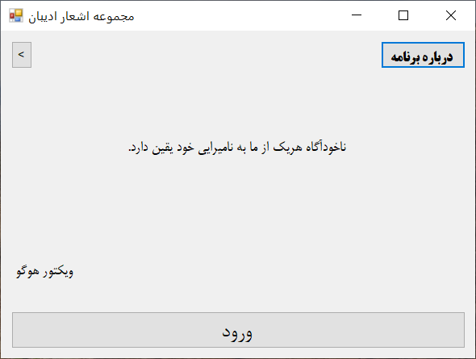
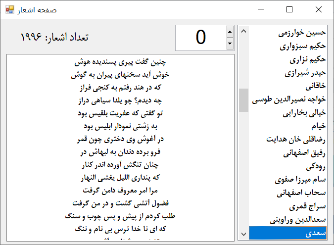

# AdibanPoems
مجموعه اشعار ادیبان
# معرفی پروژه AdibanPoems
<p align="center">
  
  
</p>
**AdibanPoems** یک اپلیکیشن دسکتاپ ویندوزی (ساخته شده با #C و Windows Forms) است که دو قابلیت اصلی دارد:

1. **نمایش نقل‌قول‌های تصادفی** از مشاهیر، همراه با نام نویسنده.
2. **مرور اشعار شاعران بزرگ فارسی** با امکان انتخاب شاعر و جابه‌جایی بین اشعار.

داده‌های این برنامه از **سایت گنجور** (https://ganjoor.net) جمع‌آوری و پردازش شده‌اند. گنجور یکی از جامع‌ترین منابع اشعار فارسی است و تمام نقل‌قول‌ها و اشعار موجود در این برنامه، برگرفته از این پایگاه ارزشمند می‌باشند.

---

## ویژگی‌ها

- **نقل‌قول تصادفی**: با هر بار کلیک بر دکمه «نقل قول جدید»، یک جملهٔ الهام‌بخش به همراه نویسنده‌اش نمایش داده می‌شود.
- **گنجینهٔ اشعار**: در بخش اشعار، لیستی از شاعران (برگرفته از دیتابیس SQLite) قابل مشاهده است. با انتخاب هر شاعر، تمام اشعار او به ترتیب شماره نمایش داده می‌شوند و می‌توان با استفاده از شماره‌گر، بین آن‌ها جابه‌جا شد.
- **رابط کاربری ساده و روان**: طراحی شده با اجزای  (مانند `labelX`، `buttonX` و `listBoxAdv`) برای تجربهٔ کاربری بهتر.
- **اطلاعات برنامه**: بخش «درباره» شامل نسخهٔ برنامه و اطلاعات تماس (که با کلیک روی آن‌ها در کلیپ‌بورد کپی می‌شوند) می‌باشد.

---

## نحوهٔ استفاده

1. برنامه را اجرا کنید.
2. در صفحهٔ اصلی (`Form1`) یک نقل‌قول به صورت تصادفی نمایش داده می‌شود.
   - با کلیک روی دکمهٔ «نقل قول جدید»، نقل‌قول دیگری ظاهر می‌شود.
   - با کلیک روی دکمهٔ «اشعار» به بخش اشعار می‌روید.
   - دکمهٔ «درباره» اطلاعات برنامه را نمایش می‌دهد.
3. در صفحهٔ اشعار (`Form2`):
   - از لیست کشویی یا جعبهٔ لیست، شاعر مورد نظر را انتخاب کنید.
   - اولین شعر آن شاعر به همراه تعداد کل اشعار نمایش داده می‌شود.
   - با تغییر عدد در شماره‌گر، شعر بعدی یا قبلی را مشاهده کنید.
4. در صفحهٔ اطلاعات (`info`):
   - نسخهٔ برنامه را مشاهده می‌کنید.
   - با کلیک روی هر یک از برچسب‌های ایمیل، تلگرام و... متن آن در کلیپ‌بورد کپی می‌شود.

---

## منبع داده‌ها

تمام نقل‌قول‌ها (`QOUETS.json`) و اشعار (`Poetry.db`) از **سایت گنجور** استخراج شده‌اند. گنجور یک پروژهٔ آزاد و متن‌باز برای گردآوری دیوان اشعار فارسی است و ما از داده‌های آن با ذکر منبع استفاده کرده‌ایم.

- **نقل‌قول‌ها**: فایل JSON شامل حدود ۳۸۶ نقل‌قول با فیلدهای `body` (متن) و `author` (نویسنده).
- **اشعار**: پایگاه دادهٔ SQLite شامل دو جدول:
  - `Poets`: شامل شناسه و نام شاعران.
  - `Poems`: شامل شناسه، شناسهٔ شاعر و متن شعر.

---

## تکنولوژی‌های استفاده‌شده

- **#C** و **.NET Framework** (Windows Forms)
- **SQLite** (برای ذخیره‌سازی و بازیابی اشعار)
- **Newtonsoft.Json** (برای خواندن فایل JSON نقل‌قول‌ها)
---

## نحوهٔ نصب و اجرا (برای توسعه‌دهندگان)

1. مخزن را کلون کنید:
   ```bash
   git clone https://github.com/amindahyat/RandomQuotes.git
   ```
2. پروژه را در **Visual Studio** (نسخهٔ ۲۰۱۹ یا بالاتر) باز کنید.
3. مطمئن شوید که فایل‌های داده در مسیر `\DATA\` قرار دارند:
   - `QOUETS.json`
   - `Poetry.db`
4. بسته‌های NuGet مورد نیاز را بازیابی کنید:
   - `Newtonsoft.Json`
   - `System.Data.SQLite`
5. پروژه را کامپایل و اجرا کنید (`F5`).

---

## مجوز (License)

این پروژه تحت **مجوز MIT** منتشر می‌شود – استفاده، کپی، تغییر و توزیع آن با ذکر منبع مجاز است.

---

## تقدیر و تشکر

از **سایت گنجور** (https://ganjoor.net) و تمامی دست‌اندرکاران آن به‌خاطر فراهم‌آوردن این گنجینهٔ ارزشمند از ادبیات فارسی سپاسگزاریم.

---

## تماس

در صورت وجود هرگونه سؤال یا پیشنهاد، می‌توانید از طریق اطلاعات مندرج در بخش «درباره» با ما در ارتباط باشید.


---
**تاریخ انتشار:** ۲۰۲۶  
**نسخه:** مطابق با `ProductVersion` در برنامه.
